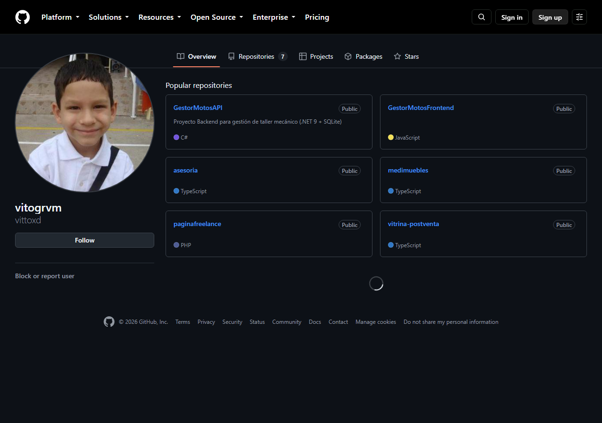
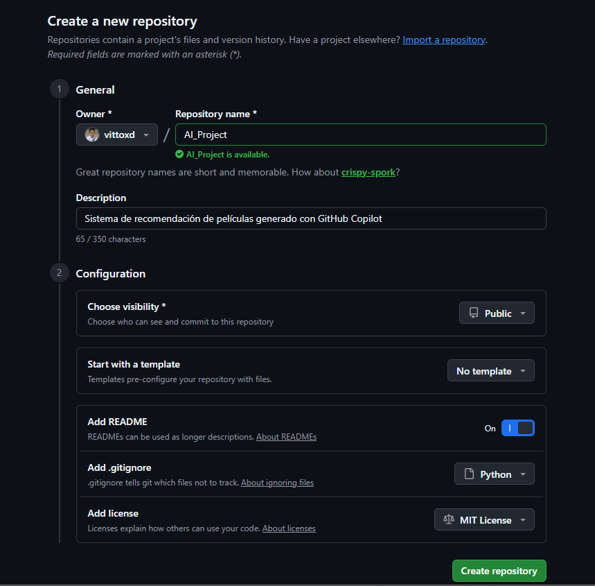
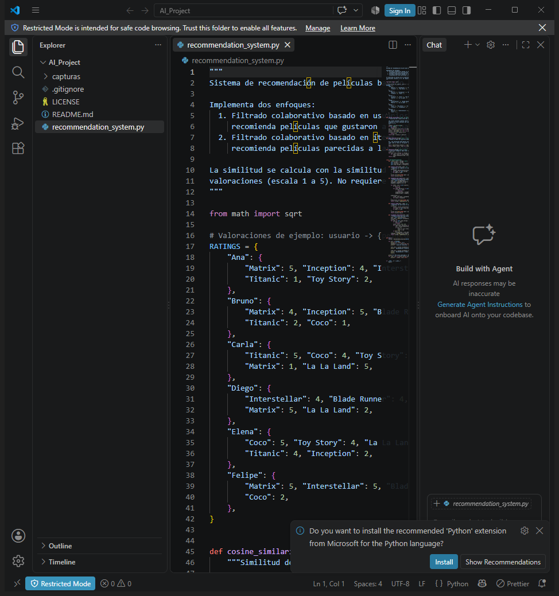
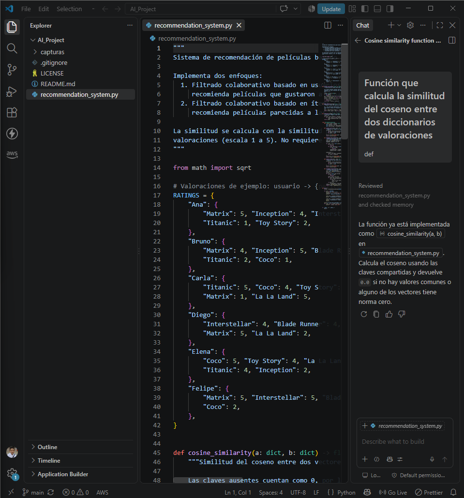
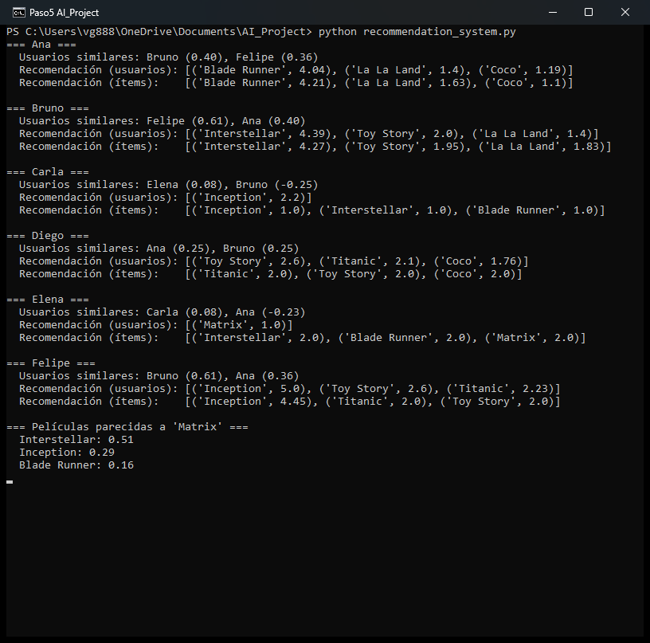
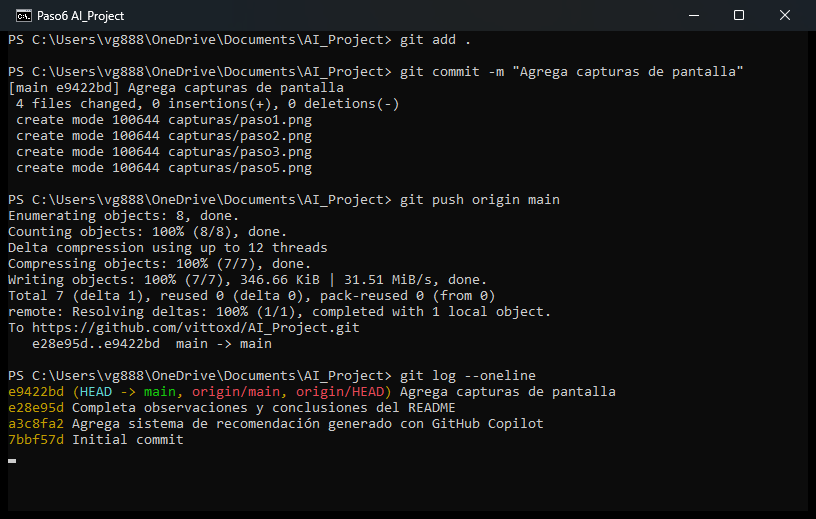

# AI_Project — Sistema de recomendación con GitHub Copilot

**Asignatura:** ETVI02 — Tendencias emergentes en IA · Unidad 3, Semana 8
**Actividad formativa:** GitHub Copilot
**Estudiante:** _[Tu nombre completo]_
**Fecha:** _[dd/mm/aaaa]_

---

## 1. Descripción del proyecto

Este repositorio contiene un **sistema de recomendación de películas** escrito en Python, cuyo código inicial se generó con **GitHub Copilot** dentro de Visual Studio Code.

El sistema aplica **filtrado colaborativo**, una de las técnicas de IA más usadas en plataformas como Netflix, Spotify o Amazon:

| Enfoque | Idea | Método |
|---|---|---|
| Basado en usuarios | "A usuarios parecidos a ti les gustó X" | `recommend_user_based()` |
| Basado en ítems | "X se parece a lo que ya te gustó" | `recommend_item_based()` |

Para medir el parecido se usa la **similitud del coseno** sobre las valoraciones centradas en la media de cada usuario. Así, una nota baja cuenta como "no me gustó" y no como un "me gustó" más débil.

## 2. Requisitos

- Python 3.8 o superior (no necesita librerías externas)
- Visual Studio Code con la extensión **GitHub Copilot**
- Git

## 3. Cómo ejecutarlo

```bash
python recommendation_system.py
```

Salida de ejemplo (fragmento):

```
=== Ana ===
  Usuarios similares: Bruno (0.40), Felipe (0.36)
  Recomendación (usuarios): [('Blade Runner', 4.04), ('La La Land', 1.4), ('Coco', 1.19)]
  Recomendación (ítems):    [('Blade Runner', 4.21), ('La La Land', 1.63), ('Coco', 1.1)]
```

El número junto a cada película es la **nota que el sistema predice** (de 1 a 5). A Ana le gustan la ciencia ficción y las películas de Nolan, así que el sistema le recomienda *Blade Runner* con una nota alta y predice notas bajas para las demás.

---

## 4. Proceso seguido (paso a paso)

> Reemplaza cada `capturas/pasoX.png` por tu propia captura. Guarda las imágenes en una carpeta `capturas/` dentro del repositorio.

### Paso 1 — Crear la cuenta en GitHub y activar Copilot
Entré en <https://github.com/>, creé mi cuenta y validé el correo electrónico. En la sección de precios de GitHub Copilot elegí el plan **gratuito** (o el beneficio para estudiantes de GitHub Education).



### Paso 2 — Crear el repositorio
Pulsé **New** y creé el repositorio `AI_Project` con visibilidad _[pública/privada]_. Añadí un `README`, un `.gitignore` (plantilla Python) y una licencia _[MIT / ninguna]_. Por último pulsé **Create repository**.



### Paso 3 — Clonar el repositorio en Visual Studio Code
Abrí la terminal integrada de VS Code (`Ctrl + ñ`) y ejecuté:

```bash
git clone https://github.com/<tu-usuario>/AI_Project.git
cd AI_Project
```



### Paso 4 — Crear el archivo y generar el código con Copilot
Creé el archivo `recommendation_system.py` y escribí comentarios que describían lo que necesitaba. Copilot sugirió el código, y yo lo acepté con `Tab` y lo fui revisando. Algunos de los comentarios que usé:

```python
# Función que calcula la similitud del coseno entre dos diccionarios de valoraciones
# Clase RecommendationSystem que recomiende películas usando filtrado colaborativo
# Método que devuelva los usuarios más parecidos a un usuario dado
```



**Observaciones sobre Copilot:**
- _[Qué sugerencias fueron útiles]_
- _[Qué tuviste que corregir o ajustar a mano]_
- _[Si usaste Copilot Chat, qué le preguntaste]_

### Paso 5 — Probar el programa
Ejecuté `python recommendation_system.py` y comprobé que las recomendaciones eran coherentes con los gustos de cada usuario.



### Paso 6 — Commit y push
```bash
git add .
git commit -m "Agrega sistema de recomendación generado con GitHub Copilot"
git push origin main
```



---

## 5. Relación con las tendencias emergentes en IA

- **IA generativa aplicada a la programación:** Copilot usa modelos de lenguaje de gran tamaño (LLM) para convertir descripciones en lenguaje natural en código.
- **Sistemas de recomendación:** son una de las aplicaciones de IA con más impacto comercial y personalizan el contenido para cada usuario.
- **Programación asistida:** el desarrollador pasa de escribir cada línea a guiar, revisar y validar lo que propone la IA.

## 6. Conclusiones

_[Escribe 3–5 líneas con tu opinión: qué aprendiste, ventajas y limitaciones de Copilot y en qué casos lo volverías a usar.]_

## 7. Referencias

- GitHub. (s. f.). *GitHub Copilot Documentation*. <https://docs.github.com/en/copilot>
- GitHub. (s. f.). *Getting Started with GitHub Copilot*. <https://docs.github.com/en/copilot/getting-started-with-github-copilot>
